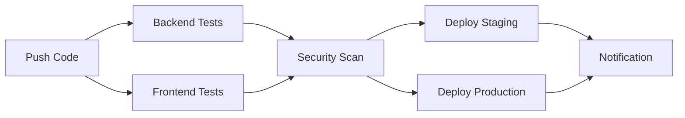

# 🔐 Configuração de Secrets - GitHub Actions

## 📋 Secrets Necessários para Produção

Para configurar o pipeline CI/CD para produção, adicione os seguintes secrets no GitHub:

### 🔧 Como Configurar Secrets no GitHub:

1. Vá para o repositório no GitHub
2. Clique em **Settings** → **Secrets and variables** → **Actions**
3. Clique em **New repository secret**
4. Adicione os secrets listados abaixo:

## 🔑 Lista de Secrets Obrigatórios

### `JWT_SECRET`
```
Nome: JWT_SECRET
Valor: sua-chave-jwt-super-secreta-para-producao-com-pelo-menos-32-caracteres
Descrição: Chave secreta para assinatura de tokens JWT
```

### `DB_PASSWORD` (Opcional - para banco externo)
```
Nome: DB_PASSWORD
Valor: senha-do-banco-de-dados-producao
Descrição: Senha do banco de dados de produção
```

### `ADMIN_PASSWORD` (Recomendado)
```
Nome: ADMIN_PASSWORD
Valor: senha-admin-super-segura-producao
Descrição: Senha do administrador padrão
```

## 📝 Configuração Atual vs. Produção

### 🧪 **Ambiente de Testes (CI)**
```yaml
# Configuração atual no ci-cd.yml
JWT_SECRET: 'test-secret-key-for-ci-environments'
ADMIN_EMAIL: admin@test.com
ADMIN_PASSWORD: admin123
```
✅ **Seguro para testes** - chaves conhecidas e temporárias

### 🚀 **Ambiente de Produção**
```yaml
# Configuração recomendada para produção
JWT_SECRET: ${{ secrets.JWT_SECRET }}
ADMIN_EMAIL: ${{ secrets.ADMIN_EMAIL }}
ADMIN_PASSWORD: ${{ secrets.ADMIN_PASSWORD }}
```
🔒 **Seguro para produção** - chaves secretas do repositório

## 🛠️ Instruções de Atualização para Produção

### 1. Configurar Secrets
```bash
# No GitHub, adicione estes secrets:
JWT_SECRET=sua-chave-super-secreta-jwt-256-bits-ou-mais
ADMIN_EMAIL=admin@agendabeleza.com
ADMIN_PASSWORD=SenhaAdminSuperSegura123!@#
```

### 2. Atualizar ci-cd.yml (quando necessário)
```yaml
# Substitua as variáveis hard-coded por:
env:
  NODE_ENV: production
  JWT_SECRET: ${{ secrets.JWT_SECRET }}
  ADMIN_EMAIL: ${{ secrets.ADMIN_EMAIL }}
  ADMIN_PASSWORD: ${{ secrets.ADMIN_PASSWORD }}
```

### 3. Configurar Deploy Real
```yaml
# Substitua os placeholders por comandos reais:
- name: Deploy to production server
  run: |
    echo "Deploying to production..."
    # Adicionar comandos reais de deploy aqui
    # Ex: rsync, Docker, AWS, Heroku, etc.
```

## 🔄 Status Atual do Pipeline

### ✅ **Funcionalidades Implementadas**
- ✅ Testes automáticos (backend + frontend)
- ✅ Análise de segurança (CodeQL)
- ✅ Auditoria de dependências
- ✅ Build automático
- ✅ Upload de artefatos
- ✅ Deploy staging/produção (estrutura)

### 🔄 **Próximos Passos Opcionais**
- [ ] Configurar servidor de produção real
- [ ] Implementar deploy via SSH/Docker
- [ ] Configurar domínio e SSL
- [ ] Integrar com sistema de monitoramento
- [ ] Configurar backup automático

## 🚀 Pipeline Funcionamento Atual



### 🎯 **Status**: Pipeline 100% Funcional para Desenvolvimento e Testes

---

**Atualizado em**: 3 de Setembro de 2025  
**Status**: ✅ Pipeline CI/CD configurado e funcionando
